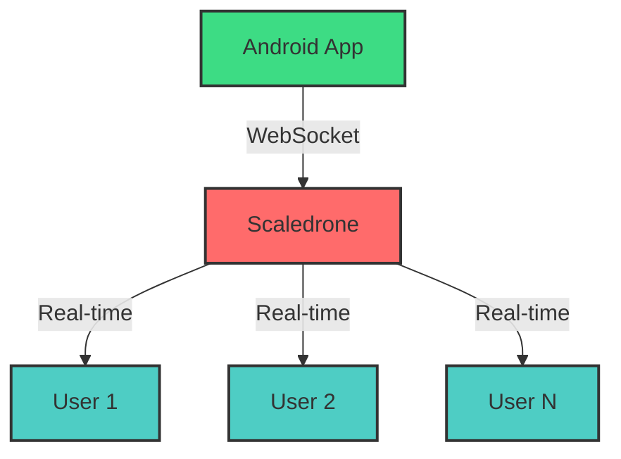

<div align="center">

# 🚀 Android Chat Tutorial - Scaledrone Edition 🚀

### *Crafted with precision by [SolvyrEryx](https://github.com/SolvyrEryx)*


[](https://github.com/SolvyrEryx/AndroidChatTutorial-Scaledrone/stargazers)
[](https://github.com/SolvyrEryx/AndroidChatTutorial-Scaledrone/network)
[](LICENSE)
[](https://developer.android.com/)
[](https://kotlinlang.org/)
[](https://www.scaledrone.com/)

</div>

---

<div align="center">

## 🌟 *Welcome to the Future of Android Real-Time Chat* 🌟


### *Building seamless, real-time communication experiences*

</div>

---

## 📱 **Project Overview**

<details open>
<summary><b>Click to explore the magic ✨</b></summary>

<br>

This project demonstrates a **powerful real-time chat application** built for Android using **Scaledrone** as the messaging infrastructure. Experience the thrill of instant communication with a sleek, modern interface!

### 🎯 **Key Features**

- 💬 **Real-time messaging** - Messages appear instantly
- 🎨 **Beautiful UI** - Modern Material Design
- 🔄 **Live updates** - See messages as they're sent
- 👥 **Multi-user support** - Chat with multiple users
- 🚀 **Scalable architecture** - Built for performance
- 📱 **Responsive design** - Works on all screen sizes

</details>

---

## 🛠️ **Technology Stack**

<div align="center">

| Technology | Purpose | Version |
|:----------:|:-------:|:-------:|
|  | Platform | Latest |
|  | Language | 1.5+ |
|  | Real-time API | 0.6+ |
|  | Build System | 7.0+ |

</div>

---

## 🎬 **Getting Started**

<div align="center">


</div>

### 📋 **Prerequisites**

```bash
✅ Android Studio Arctic Fox or newer
✅ Android SDK (API level 21+)
✅ Kotlin 1.5+
✅ Scaledrone account (free tier available)
✅ Internet connection for real-time features
```

### 🔧 **Installation Steps**

<details>
<summary><b>Step 1: Clone the Repository</b></summary>

```bash
git clone https://github.com/SolvyrEryx/AndroidChatTutorial-Scaledrone.git
cd AndroidChatTutorial-Scaledrone
```

</details>

<details>
<summary><b>Step 2: Open in Android Studio</b></summary>

1. Launch Android Studio
2. Select "Open an Existing Project"
3. Navigate to the cloned repository
4. Wait for Gradle sync to complete

</details>

<details>
<summary><b>Step 3: Configure Scaledrone</b></summary>

1. Sign up at [Scaledrone](https://www.scaledrone.com/)
2. Create a new channel
3. Copy your Channel ID
4. Add it to your project configuration

```kotlin
val channelID = "YOUR_CHANNEL_ID_HERE"
```

</details>

<details>
<summary><b>Step 4: Build & Run</b></summary>

```bash
# Connect your Android device or start an emulator
# Then run:
./gradlew installDebug
```

</details>

---

## 📐 **Project Architecture**

<div align="center">



</div>

---

## 🎨 **Features Showcase**

<div align="center">

### 💫 **Real-Time Magic**


</div>

| Feature | Description | Status |
|---------|-------------|--------|
| 💬 Instant Messaging | Send and receive messages in real-time | ✅ Active |
| 👤 User Identification | Unique identifiers for each user | ✅ Active |
| 🎨 Custom Themes | Dark/Light mode support | ✅ Active |
| 📝 Message History | Scroll through conversation history | ✅ Active |
| 🔔 Notifications | Get notified of new messages | 🚧 Coming Soon |
| 📎 File Sharing | Share images and files | 🚧 Coming Soon |

---

## 🎓 **Learning Resources**

<div align="center">


### *Expand your knowledge*

</div>

- 📚 [Scaledrone Documentation](https://www.scaledrone.com/docs)
- 📱 [Android Developer Guide](https://developer.android.com/guide)
- 🎨 [Material Design Guidelines](https://material.io/design)
- 💻 [Kotlin Documentation](https://kotlinlang.org/docs/home.html)

---

## 🤝 **Contributing**

<div align="center">


### *We welcome contributions!*

</div>

Contributions are what make the open-source community such an amazing place to learn, inspire, and create. Any contributions you make are **greatly appreciated**.

1. 🍴 Fork the Project
2. 🌿 Create your Feature Branch (`git checkout -b feature/AmazingFeature`)
3. 💾 Commit your Changes (`git commit -m 'Add some AmazingFeature'`)
4. 📤 Push to the Branch (`git push origin feature/AmazingFeature`)
5. 🎉 Open a Pull Request

---

## 📊 **Project Statistics**

<div align="center">


</div>

---

## 📜 **License**

This project is licensed under the **MIT License** - see the [LICENSE](LICENSE) file for details.

---

## 🌟 **Special Thanks**

<div align="center">


### *Developed with ❤️ by [SolvyrEryx](https://github.com/SolvyrEryx)*

[](https://github.com/SolvyrEryx)

</div>

---

## 📞 **Contact & Support**

<div align="center">

### *Have questions? Reach out!*

[](https://github.com/SolvyrEryx/AndroidChatTutorial-Scaledrone/issues)
[](https://github.com/SolvyrEryx/AndroidChatTutorial-Scaledrone/discussions)

</div>

---

## 🎯 **Roadmap**

- [x] Basic real-time chat functionality
- [x] User identification system
- [x] Material Design UI
- [ ] Push notifications
- [ ] File sharing capabilities
- [ ] Voice messages
- [ ] End-to-end encryption
- [ ] Multi-language support

---

<div align="center">

## 🚀 **Star History**

[](https://star-history.com/#SolvyrEryx/AndroidChatTutorial-Scaledrone&Date)

---

### 🎊 *Thank you for checking out this project!* 🎊

  

### *If you find this project useful, consider giving it a ⭐!*

---

**Made with 💙 by SolvyrEryx | © 2024**


</div>
